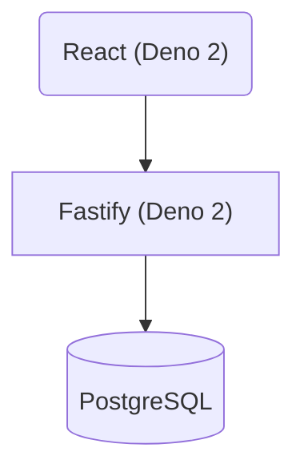

# cas.codes

This is my porfolio website!

It's built in a monorepo containing both the frontend and backend code. CI/CD uses Github Actions, and can independently identify if frontend or backend code was modified, only deploying what is necessary.

The frontend uses Deno 2, React, and TailwindCSS. (`./apps/cas-codes` directory)

[Frontend README](/apps/cas-codes/README.md)

The backend uses Deno 2, Fastify, and Postgres. (`./services/api` directory)

[Backend README](/services/api/README.md)

Feel free to use it as an example of something simple built with the aforementioned tech stack!

