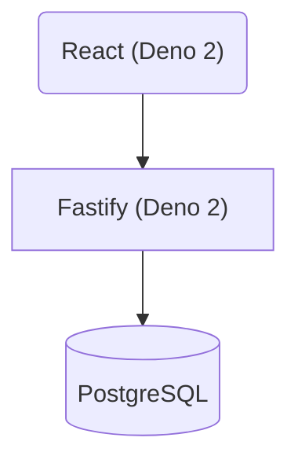

# cas.codes

This is my porfolio website!

The frontend is using Deno 2, React, and TailwindCSS. (`./apps/cas-codes` directory)

The backend is using Deno 2, Fastify, and Postgres. (`./services/api` directory)

Feel free to use it as an example of something simple built with the aforementioned tech stack!

